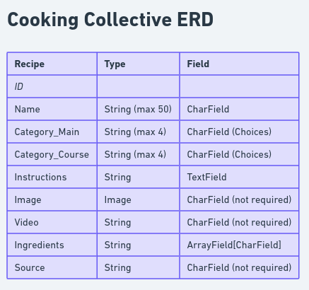

## Cooking Collective (Backend)

Cooking Collective (Backend) is a backend interface that hosts data to communicate with Cooking Collective: a site where users can post and search for new recipes!

With this interface we can create a full experience for our users where we can store and access their data. Who better to get recipe ideas from than other cooking enthusiasts!


### Getting Started

First clone the repository from Github and switch to the new directory:

    $ git clone (git@github.com/geclower/CookingCollective-Backend.git)
    $ cd CookingCollective-Backend

### Run Locally
    
Activate the virtualenv for your project.

    $ pipenv shell

You can now run the development server:

    $ python manage.py runserver
### ROUTES

Below you will find examples of the routes availble and how to access them.

View all recipes and their data
```bash
GET localhost:3000/recipes
```
View a single recipe and its data.
```bash
GET localhost:3000/recipes/:recipe_id
```
View a all recipes and its data of a certain course type.
```bash
GET localhost:3000/recipes/meal/:meal_id
```
View a all recipes and its data of a certain food type.
```bash
GET localhost:3000/recipes/food/:food_id
```


### Entry Relationship Diagram
>


### Tech Stack

- **Python**: Backend development language.
- **Django**: Web framework for building APIs and web applications.
- **Django REST Framework (DRF)**: Toolkit for building Web APIs in Django.
- **PostgreSQL**: Relational database management system for data storage.


### What's Next?
- Add users and user authentication to allow for personalized recipe feeds.
- Expand routes to allow for more specialized filter functions on the frontend.

#### Thanks to <a href="https://www.themealdb.com/api.php">The MealDB</a> for the dummy data used!

##### Frontend GitHub for <a href="https://github.com/geclower/CookingCollective-Frontend">Cooking Collective</a>